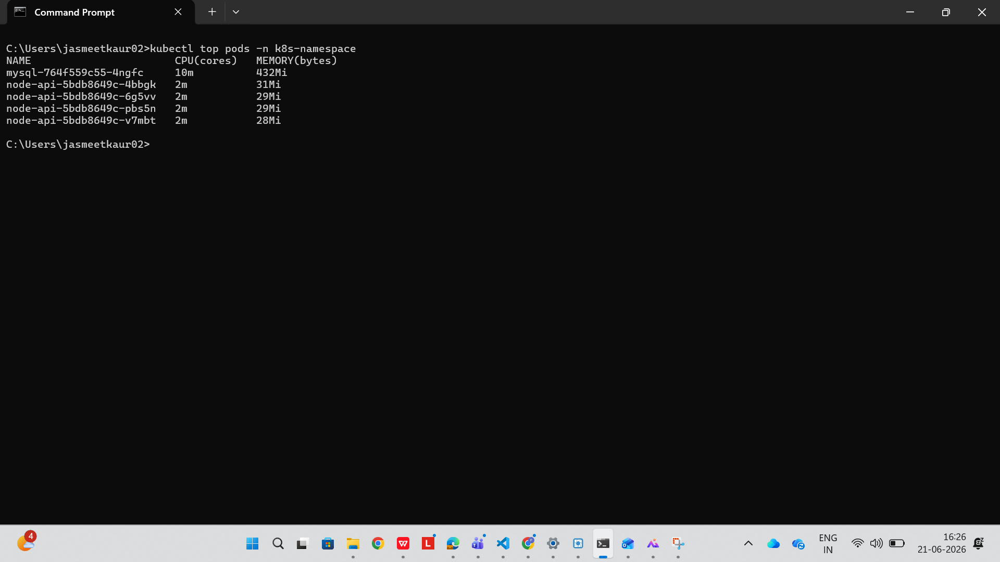
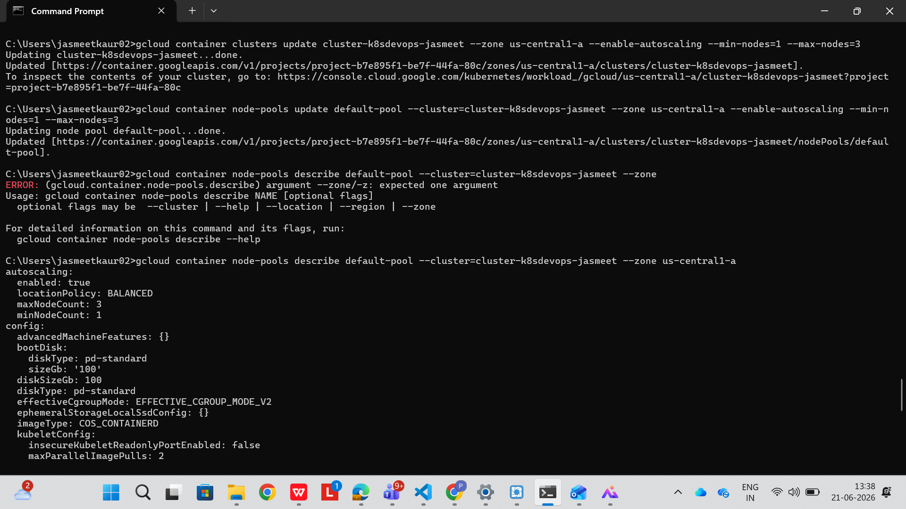

# FinOps Considerations

## Current Observed State

Node API Pods:
- CPU: approx. 2m per pod
- Memory: approx. 30Mi per pod  

MySQL Pod:
- CPU: approx. 10m  
- Memory: approx. 432Mi  

---

## Analysis

- Application runs with **4 replicas as required**
- Observed CPU usage (approx. 2m) is extremely low (~1–2%)
- Indicates underutilization of compute resources
- Resources are not efficiently utilized during low traffic

---

## Identified Problems

- Fixed baseline replicas (minimum 4 required)
- Low CPU utilization
- Idle resources during non-peak load
- Potential over-provisioning of cluster nodes
- No automatic scaling in initial setup

---

## Optimization Strategies Implemented

#### 1. Resource Right-Sizing (Based on Observed Metrics)

Using actual metrics (`kubectl top`), resource requests and limits were optimized:

resources:
  requests:
    cpu: "50m"
    memory: "64Mi"
  limits:
    cpu: "200m"
    memory: "128Mi"

---

#### 2. Horizontal Pod Autoscaler (HPA)

HPA is configured to scale based on CPU utilization:

- Minimum Replicas: 4 (as per requirement)
- Maximum Replicas: 6
- Target CPU Utilization: 50%

---

#### 3. Cluster Autoscaler

Cluster autoscaling is enabled to automatically adjust the number of nodes based on workload demand.

- Adds nodes when pods cannot be scheduled due to resource shortage  
- Removes underutilized nodes when demand decreases  

---

### 4. Persistent Storage Optimization (PVC & StorageClass)
- Right-sized storage allocation:
  The PVC is configured with **1Gi storage**, which is sufficient for the current workload (very minimal dataset with only a few records). This avoids over-provisioning and reduces unnecessary storage costs.

- Dynamic provisioning:
  StorageClass enables on-demand creation of PersistentVolumes, ensuring that storage is only allocated when required.

- Cost-aware storage usage:
  A minimal storage size is chosen instead of default larger sizes (e.g., 10Gi), demonstrating efficient resource utilization.

- Efficient persistence strategy:
  MySQL uses persistent storage to retain data across pod restarts, avoiding repeated initialization overhead and improving operational efficiency.

- Observation:
  Current database usage is extremely low, indicating that 1Gi allocation is appropriate and cost-optimized for this workload.

These practices ensure optimal storage utilization while minimizing cloud costs.

---

### 5. Namespace-based Resource Governance
All resources are deployed within a dedicated namespace:
k8s-namespace

This enables:
Logical isolation of application components
Monitoring resource usage:
kubectl top pods -n k8s-namespace

Supports future implementation of:
ResourceQuota
LimitRange

This improves cost visibility and enforces resource governance.

## Cost Optimization Impact

- Maintains required **baseline availability (4 pods)**
- Scales pods **only when needed (HPA)**
- Scales infrastructure **only when required (Cluster Autoscaler)**
- Optimizes storage and runtime configuration through PVC sizing
- Avoids over-provisioning of both pods and nodes
- Improves overall resource utilization
- Reduces cost during idle and low-traffic periods

---

## Scaling Behavior

| Scenario | Pod Scaling | Node Scaling |
|---------|-----------|-------------|
| Low load | 4 pods | Minimum nodes |
| Increasing load | 5 → 6 pods | Nodes increase if required |
| Load decreases | Back to 4 pods | Extra nodes removed |

---

## Additional Observations

- API pods are significantly underutilized  
- Memory usage is stable (~30Mi per pod)  
- MySQL memory usage (~432Mi) is relatively higher  
- Cluster autoscaler prevents unnecessary node allocation  

---

## Future Optimization Opportunities

1. **Database optimization**
  - Tune MySQL configuration for lower memory footprint

2. **Further cost optimization**
  - Use smaller machine types (for example, e2-small instead of e2-medium)
  - Optimize node pool configuration

---

## Conclusion

The system demonstrates a **complete FinOps-aware architecture**:

- HPA ensures efficient pod-level scaling  
- Cluster Autoscaler ensures efficient infrastructure scaling  
- Cost is optimized at both application and cluster level  

This results in a scalable, resilient, and cost-efficient Kubernetes deployment.
